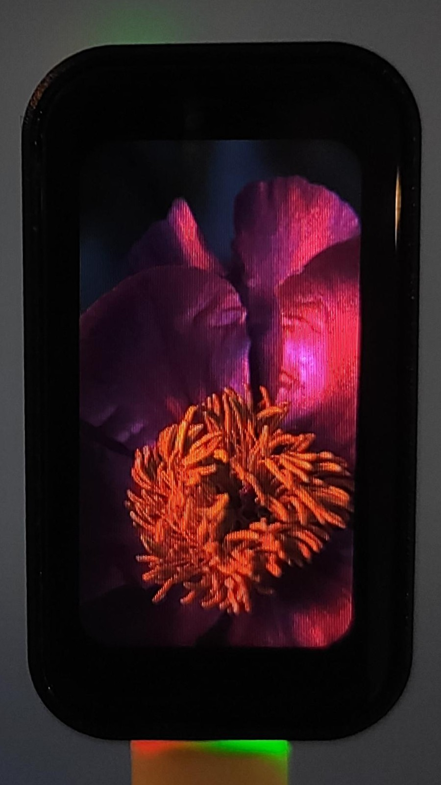
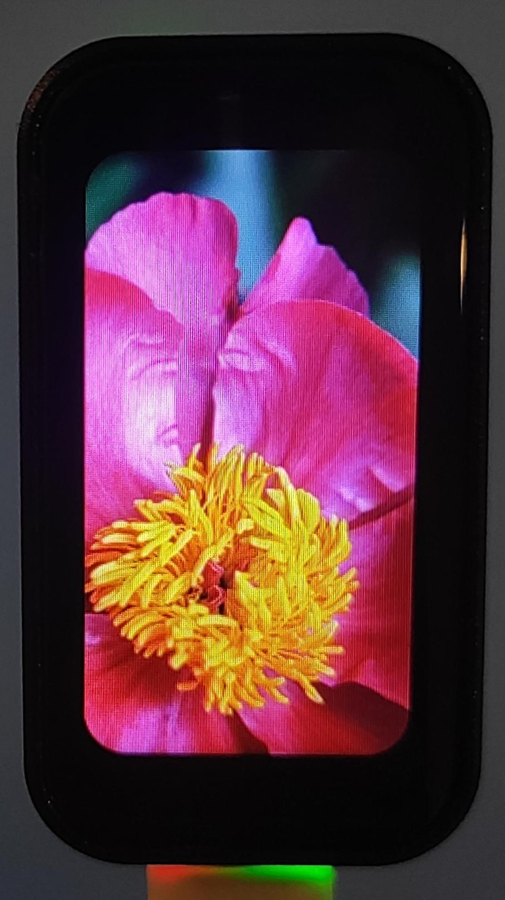

[](https://esphome.io/)

[← Back to Overview](../README.md)


# LCD Display Driver JD9853

Currently, the **JD9853 display driver** is not officially supported by ESPHome. This section demonstrates how to configure this driver by using a custom initialization sequence for [ESPHome ILI9xxx TFT displays](https://esphome.io/components/display/ili9xxx/). The JD9853 display driver is used by the **ESP32-S3 1.47" Touch Display** and the **ESP32-C6 1.47" Touch Display**.


> [!IMPORTANT]
> **Model Compatibility:** Do not confuse this board with the **ESP32-S3-LCD-1.47** or **ESP32-C6-LCD-1.47** (board versions without touch panel). Those boards use the **ST7789** driver, which is already supported by the ESPHome ILI9xxx TFT display component.

> [!NOTE]
Although I have not specifically tested the ESP32-S3-Touch-LCD-1.47, I assume it should work as well, provided the pin configuration is adjusted.


## Comparison of adapted initialization sequence

Selecting the appropriate `init_sequence` for the **JD9853** is essential. While alternative models may seem functional, a comparative analysis highlights significant discrepancies.


| ❌ Generic Driver | ✅ JD9853 Driver | Digital Source File (RGB565) |
| :-----------------------------------------  | :-----------------------------------------  | :----------------------------------------- |
| <div align="center"></div>| <div align="center"></div> |  <div align="center"></div>|
 

##  Custom Initialization Sequence
The initialization sequence includes a workaround that uses [`init_sequence`](/fschroedter/smart-home-lab/blob/main/packages/init_sequence_JD9853.yaml) processing to insert a delay required for correct configuration. For more details, see [deep dive](display_driver_JD9853_deepdive.md).

For more advanced setup options, check out the official ESPHome configuration guide for [ILI9xxx TFT displays](https://esphome.io/components/display/ili9xxx/) page.
```yaml
# Load this package to extend the display with a custom init sequence for the JD9853 display drivers
packages:
  remote_package_files:
    url: https://github.com/fschroedter/smart-home-lab
    files: [ packages/init_sequence_JD9853.yaml ]


display:
  - platform: ili9xxx
    model: CUSTOM
    id: my_display  # <-- Note: The package is adapted to 'my_display' 
    dc_pin:
      number: GPIO15
      ignore_strapping_warning: true
    cs_pin: GPIO14
    reset_pin: GPIO22
    dimensions:
      width: 172
      height: 320
      offset_width: 34
      offset_height: 0
    invert_colors: false
```
Note: This example uses the pinout from [Waveshare ESP32-C6 1.47" Touch Display](./board_esp32-c6_touch.md).

 
See here for [complete demo](https://github.com/fschroedter/smart-home-lab/blob/main/examples/init_sequence_jd9853_driver/jd9853.yaml).